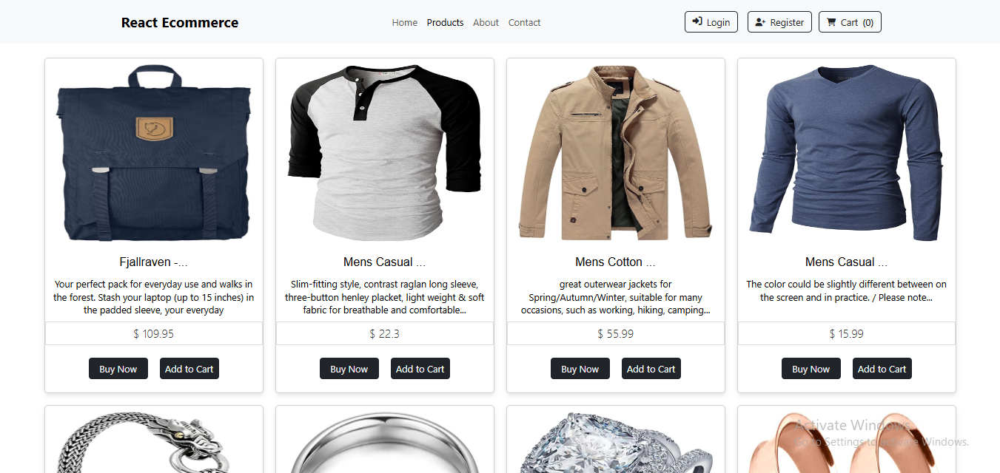

<div align="center">

<sub>Dev-Chandan404 / Ecommerce-Website</sub>

# 🛒 ShopReact — Modern E-Commerce Storefront 🛒

### *Sleek UI. Smooth Shopping. Seamless Experience.*

<br/>

[](https://dev-chandan404.github.io/Ecommerce-Website/)
[](https://github.com/Dev-Chandan404/Ecommerce-Website)
[](https://github.com/Dev-Chandan404/Ecommerce-Website/issues)

<br/>

[](https://react.dev/)
[](https://developer.mozilla.org/en-US/docs/Web/JavaScript)
[](https://developer.mozilla.org/en-US/docs/Web/CSS)
[](https://developer.mozilla.org/en-US/docs/Web/HTML)
[](https://pages.github.com/)
[](LICENSE)

<br/>

[](https://github.com/Dev-Chandan404/Ecommerce-Website/commits)
[](https://github.com/Dev-Chandan404/Ecommerce-Website)
[](https://github.com/Dev-Chandan404/Ecommerce-Website/stargazers)

<br/>

<a href="https://dev-chandan404.github.io/Ecommerce-Website/">
  
</a>

*A modern React-powered storefront built for real-world shopping experiences*

</div>

---

## ✨ About the Project

> A **modern, responsive eCommerce web application** built with React.js. The platform delivers a complete shopping interface — from product browsing to cart management — designed with a clean UI and optimized for performance across all devices.

This project demonstrates how **component-driven architecture**, **state-driven cart logic**, and **multi-page navigation** come together to power a real-world online storefront.

---

## 🎯 Key Features

| | Feature | Description |
|---|---|---|
| 🛍️ | **Product Listings** | Browsable catalog with clean product cards |
| 🛒 | **Dynamic Cart** | Add, remove, and update cart items in real time |
| 🔐 | **User Authentication** | Login and signup flow for a personalized experience |
| 💳 | **Checkout Experience** | Smooth, intuitive checkout-style interface |
| 📱 | **Fully Responsive** | Mobile-first design, flawless on all screen sizes |
| ⚛️ | **Component Architecture** | Scalable, reusable React component structure |

---

## 🛠️ Built With

<div align="center">

| React | JavaScript | CSS3 | HTML5 | GitHub Pages |
|-------|------------|------|-------|--------------|
|  |  |  |  |  |

</div>

---

## 📂 Website Sections

| Section | Description |
|---------|-------------|
| 🏠 **Home** | Landing page with featured products and promotions |
| 🛍️ **Products** | Full product listing with browsing and filtering |
| 📦 **Product Detail** | Individual product view with description and options |
| 🛒 **Cart** | Dynamic cart with live quantity and total updates |
| 🔐 **Auth** | User login and registration flow |
| 💳 **Checkout** | Order summary and checkout experience |

---

## 🚀 Getting Started

```bash
# Clone the repo
git clone https://github.com/Dev-Chandan404/Ecommerce-Website.git
cd Ecommerce-Website

# Install dependencies
npm install

# Start dev server → http://localhost:3000
npm start

# Build for production
npm run build
```

---

## 📁 Project Structure

```
Ecommerce-Website/
├── 📂 public/              # Static assets (images, icons)
├── 📂 src/
│   ├── 📂 components/      # Reusable UI components
│   ├── 📂 pages/           # Route-level page views
│   ├── 📂 assets/          # Images and media resources
│   ├── App.js              # Root application component
│   └── index.js            # App entry point
├── package.json
└── README.md
```

---

## 🔭 Roadmap & Possible Extensions

- [ ] Connect to real backend (Node.js / Firebase / Django)
- [ ] Payment gateway integration (Stripe / Razorpay)
- [ ] Database-driven product catalog
- [ ] Admin dashboard for inventory management
- [ ] Global state management (Redux / Context API)
- [ ] Full-stack deployment with API support

---

<div align="center">

## 📄 License

Distributed under the **MIT License**. See `LICENSE` for more information.

<br/>

✨ **Let's Connect** ✨

[](mailto:dev.chandankumar404@gmail.com)
[](https://github.com/Dev-Chandan404)
[](https://chandan404.netlify.app/)

<br/>

⭐ **If you like this project, please give it a star!** ⭐

*Made with ❤️ by **Chandan Kumar***

</div>
